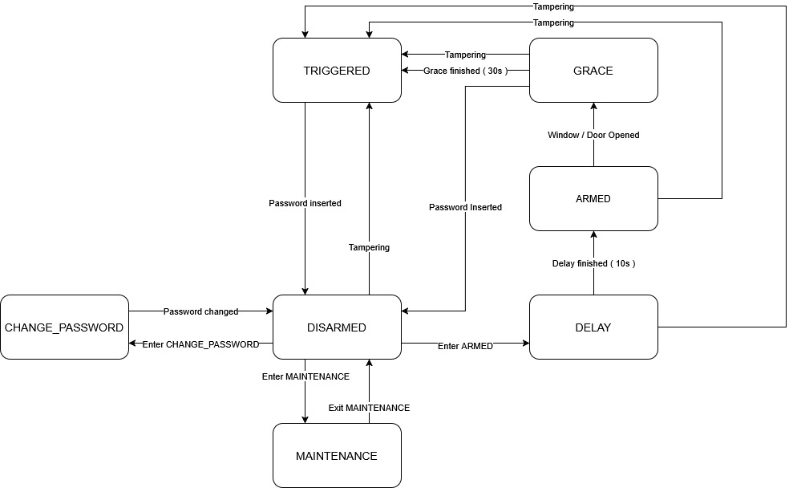

# Security System Project

- [Security System Project](#Security-System-Project)
  - [Video](#video)
  - [Requirements](#requirements)
  - [Getting started](#Setting-Up-the-CCS-Project)
  - [Team members](#team-members)
  - [Project diagram](#project-diagram)
  - [Project Structure](#project-structure)

## Video
- [Video presentation](https://youtu.be/eTPUM3vqygU)

This repository contains the source code for the SecuritySystem project, developed for the Embedded Software for the Internet of Things course at the University of Trento. The project is designed using Code Composer Studio (Version 12.7.1.00001) and includes all necessary dependencies, which are already present in the repository.  

Follow the instructions below to set up the CCS project.

---

## FINITE STATE MACHINE DIAGRAM



## Requirements

### Hardware Requirements

Main Board:
- [TI MSP432P401R Microcontroller](https://www.ti.com/lit/ds/slas826e/slas826e.pdf)
- [TI BOOSTXL-EDUMKII BoosterPack](https://www.ti.com/tool/BOOSTXL-EDUMKII)
  - On board sensors used:
    - light sensor
    - temperature sensor
  - On board components used:
    - joystick
    - buzzer
    - leds
    - display
  - keypad
  - wires

Sensor connected via MQTT:
- ESP32 – 3 for this application
- 2 KY-003 – magnetic sensor used to detect door/window opening
- PIR – movement detection
- Magnets
You can easily see the pin you have to connect a sensor to in the code, the Vcc, SGN and GND pins may vary depending on your sensor, please consult the Datasheet.

### Connections
The system is designed around the MSP432P401R Microcontroller + Boosterpack, which coordinates various peripherals as follows:
- **LEDs**: A series of LEDs embedded into the MSP432, including:
  - A Red LED connected to pin P2.5.
  - A Green LED connected to pin P2.6.
  - A Blue LED connected to pin P5.6.
- **Keypad**: A 4x4 keypad matrix is interfaced with the MSP432 to facilitate user input.

  Columns are connected to pins P6.6, P6.7, P2.3, and P3.5, while rows are connected to pins P3.0, P1.7, P5.2, and P3.6.
- **Alarm Buzzer**: The alarm buzzer outputs through pin P2.7, utilizing Timer PWM for operation.
- **ESP32**: Handles communication with other ESPs to signal door/window opening and movement detection. It's connected to P5.5.

These components are integral to the functionality of the alarm system, ensuring robust monitoring and interaction capabilities.

## Software Requirements

[CodeComposerStudio](https://www.ti.com/tool/download/CCSTUDIO/12.2.0)

## Setting Up the CCS Project

1. **Clone the Repository**

2. **Set the Workspace in Code Composer Studio (CCS)**
  - Launch Code Composer Studio.
  - When prompted, set the workspace directory to:
    ```
      <project_root>/central/workspace
    ```
    Replace <project_root> with the path to the root folder of the cloned repository.

3. **Configure the Path Variable for Libraries**
  To set up the library path variable in CCS:
    - Navigate to Window → Preferences.
    - In the preferences window:
      - Go to Code Composer Studio → Build → Variables.
      - Click on "New" to create a new variable.
    - Configure the variable as follows:
      - Name: IOT_PROJECT_ROOT
      - Type: Directory
      - Value: Set this to the root folder of the project. By default, this is:
        ```
            SecuritySystem
        ```

## Notes

- On Windows, errors might occur due to excessively long pathnames. To resolve this issue, you can follow the solution outlined in this [Stack Overflow thread](https://stackoverflow.com/questions/22575662/filename-too-long-in-git-for-windows).  
  Specifically, refer to the "Appendix - Doing it all from PowerShell - the copy-paste edition" section.

## MQTT Setup
MQTT (Message Queuing Telemetry Transport) is lightweight and efficient messaging protocol, that uses minimal bandwidth and system resources.
In MQTT, the broker is a central server that manages message distribution between clients. It acts as an intermediary, receiving messages from publishers and forwarding them to the appropriate subscribers based on topic-based filtering.

### For this project, two different solutions are available:
#### 1. Broker Deployed on an ESP32
In this approach, the broker runs directly on a single ESP32. This solution is ideal for a self-contained system, as all components are deployed on your devices without requiring external infrastructure. However, there are some important trade-offs to consider:
- Security Risks: Since all data is stored locally on the ESP32, there is a higher risk of exposure
- Increased Power Consumption & Latency: The ESP32 is a low-power microcontroller, and running the broker on it adds computational overhead, leading to higher latency, reduced efficiency and scalability.
Due to these limitations, we recommend this solution only for simple applications that do not require advanced security or high-performance communication.

#### 2. Broker Deployed on a Separate Host
Instead of running the broker on an ESP32, it can be hosted on a separate, more powerful machine. A common choice for this setup is Mosquitto, an open-source MQTT broker. However, we have opted to use EMQX because it offers superior performance, enhanced security, and scalability.

#### Why EMQX?
- High Performance
- Strong Security Features, it supports TLS encryption for secure communication.
- User & Component Management, allows user authentication, access control, and device whitelisting, ensuring that only authorized devices can connect to the network.
- Flexibility & Extensibility
This solution is ideal for larger, more complex IoT deployments where security, scalability, and performance are critical.

## Setup
Keep in mind that everything has to be on the same network to work.

### First Solution
Use the code provided in the ESP32_broker folder and load it with your network info and the broker ip, the "broker" code contains the necessary to create the broker and everything it need while the other nodes will connect to the broker to publish the state of the sensors.

### Second Solution
Follow the setup guide on EMQX on their website, we suggest to use the docker:
[Install EMQX with Docker](https://docs.emqx.com/en/emqx/latest/deploy/install-docker.html)

Using the "subscriber" code in the Host_broker folder, add your network info and the broker ip; to do that, once you have your broker running, open the terminal on your pc acting as the host and find the IPv4 address using the command "ipconfig", and put that address in the corresponding slot in the code.
Now you can deploy it and this will be the one receiving the status of the sensor and giving them to the MSP432 board.

Set up the sensor using the "publisher" code in the Host_broker folder with the same info as the subscriber, connect your sensors and deploy the code. Now you successfully have integrated the sensor and everything should be visible on the EMQX dashboard.

## Team Members
- Niccolò Lechthaler - setup of MQTT and the respective sensors, user interface with joystick interaction
- Alessandro Nardin - development of the FSM and of the testing
- Bilal Soussane - Authentication Process: Keypad interaction, UI and logic for PASSWORD_CHANGE, light and temperature sensor
- Kuba Di Quattro - alarm interface using buzzer, leds and management of the signal from the ESP32

Note: All team members have collaborated together and/or in pairs throughout the entire development process, from system design to the debugging phase.

## Project Structure
```
├── include
│   ├── adc.h
│   ├── alarm.h
│   ├── grap.h
│   ├── HAL_I2C.h
│   ├── HAL_OPT3001.h
│   ├── HAL_TMP006.h
│   ├── keypad.h
│   ├── led.h
│   ├── lux.h
│   ├── mqtt_handler.h
│   ├── states.h
│   ├── timer.h
│   ├── ti_drivers_config.h
│   ├── tmp.h
│
├── LcdDriver
│   ├── Crystalfontz128x128_ST7735.c
│   ├── Crystalfontz128x128_ST7735.h
│   ├── HAL_MSP_EXP432P401R_Crystalfontz128x128_ST7735.c
│   ├── HAL_MSP_EXP432P401R_Crystalfontz128x128_ST7735.h
│
├── src
│   ├── main.c
│   │
│   ├── devices
│   │   ├── adc.c
│   │   ├── alarm.c
│   │   ├── grap.c
│   │   ├── HAL_I2C.c
│   │   ├── HAL_OPT3001.c
│   │   ├── HAL_TMP006.c
│   │   ├── keypad.c
│   │   ├── led.c
│   │   ├── lux.c
│   │   ├── mqtt_handler.c
│   │   ├── startup_msp432p401r_ccs.c
│   │   ├── system_msp432p401r.c
│   │   ├── timer.c
│   │   ├── ti_drivers_config.c
│   │   ├── tmp.c
│   │
│   ├── states
│       ├── armed.c
│       ├── change_password.c
│       ├── delay.c
│       ├── disarmed.c
│       ├── grace.c
│       ├── maintenance.c
│       ├── states.c
│       ├── triggered.c
```


